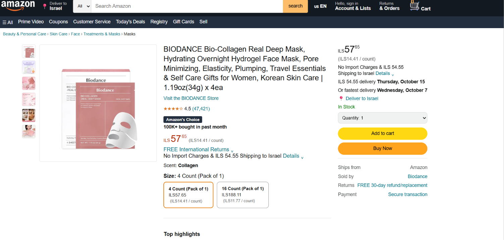

 # Amazon Product Page Clone 
A static HTML & CSS clone of an Amazon product page, built as a course project for NewTech College.

## 👤 Author
[Cedra rajabi ]

## 🔗 Links
- **Original Amazon page:** [https://a.co/d/00jvr976 ]
- **Live site (GitHub Pages):** https://ce54rg6.github.io/amazon-clone/

## 📸 Screenshot

## About This Project
This project is a static clone of an Amazon product page built with**HTML and CSS only**.

## 🛠️ What was hard
Rebuilding the buy-box layout with three unevenly-sized columns (gallery, product info, buy box) was the trickiest part — getting them to stay aligned side by side while each had different content heights took several attempts with flexbox. Getting the search bar's dropdown, input, and button to look like one connected element was also tricky at first.

- Matching the three-column layout (gallery, product info, buy box)
- Styling the price with raised currency and cents
- Getting the header search bar to take the remaining width
## 🚀 What I would improve
With more time, I would add the scent and size variation selectors, make the page fully responsive for mobile screens, and add real hover/focus states for the quantity dropdown.
